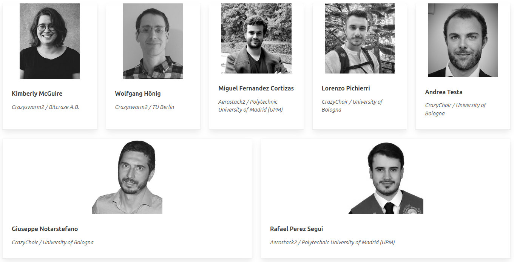
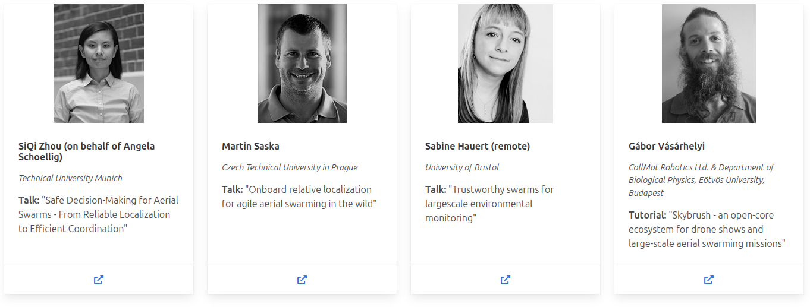

## Motivation: Aerial Swarms

- Artistic performances (+ fireworks 2.0)
- Environmental Monitoring
- Documentation of Historical Monuments
- Inspection of Critical Infrastructure

## Motivation: Challenges for Researchers

1. Demonstrations are hard
    * Can easily spend 80% of research time

2. Overwhelming number of tools
    * Feature set, documentation, robustness, maintenance vary a lot

## Motivation: Goals

1. Users: How to *select* and *use* tools for aerial swarms research

2. Tool developers: understand *use-cases* and *alternatives* better

3. Long-term: converge to *fewer*, *better* tools

## Motivation: Non-Goals

* Exhaustive overview of simulation

    * [ICRA 2023 workshop on UAV simulation](https://imrclab.github.io/workshop-uav-sims-icra2023)

    * Resulting Survey Paper (IEEE RAM 2024, to appear)

    {width=40%}

## Organizers

## Invited Speakers

## Schedule

- 14:00: "Trustworthy swarms for large-scale environmental monitoring" (by Sabine Hauert, remote)
- 14:30: Skybrush Tutorial (by Gábor Vásárhelyi)
- 15:00: Aerostack2 Tutorial (by Miguel Fernandez Cortizas and Rafael Perez Segui)
- 15:30: Coffee break
- 16:00: Crazyswarm2 Tutorial (by Kimberly McGuire and Wolfgang Hönig)
- 16:30: Crazychoir Tutorial (by Lorenzo Pichierri and Andrea Testa)
- 17:00: "Safe Decision-Making for Aerial Swarms - From Reliable Localization to Efficient Coordination" (by SiQi Zhou on behalf of Angela Schoellig)
- 17:30: "Onboard relative localization for agile aerial swarming in the wild" (by Martin Saska)
