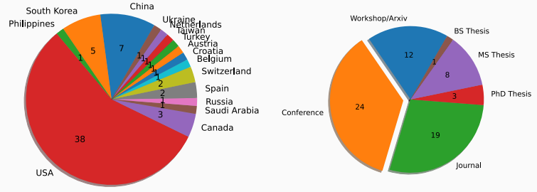
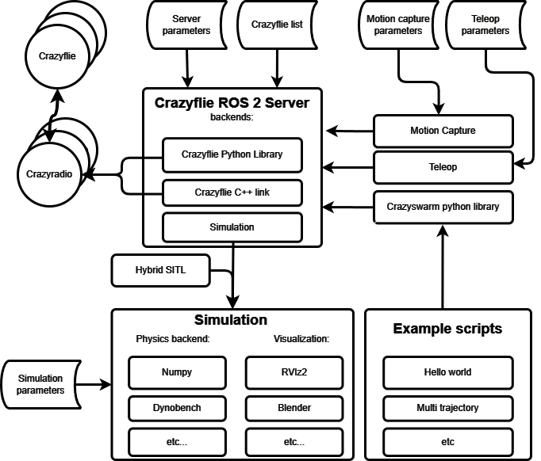
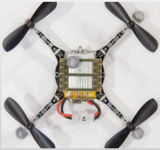
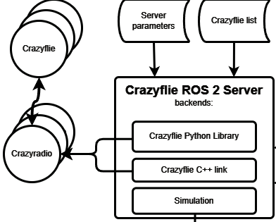
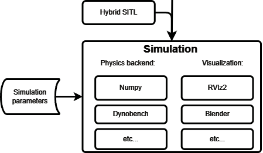
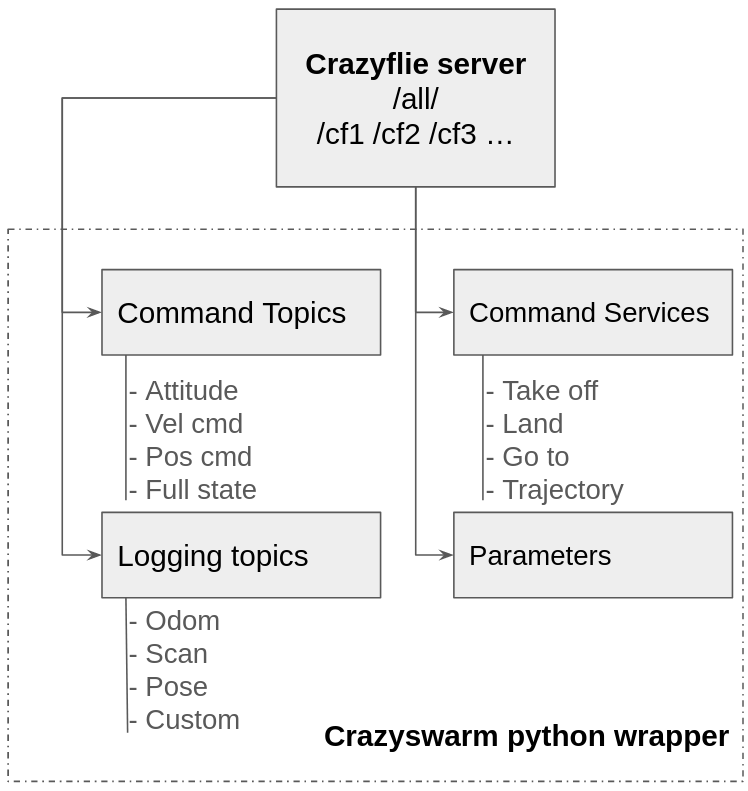
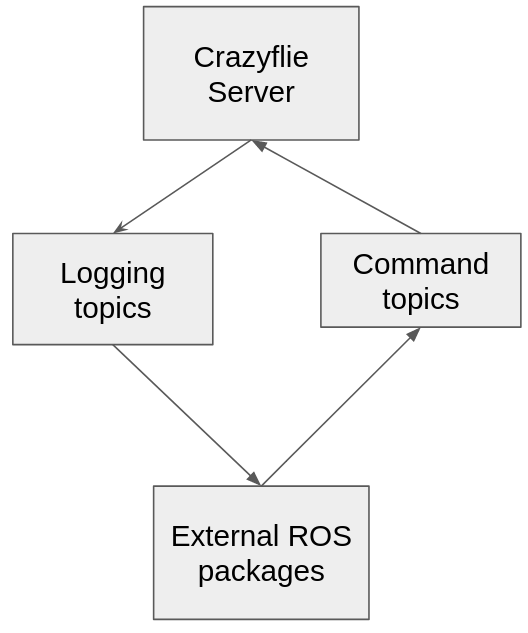
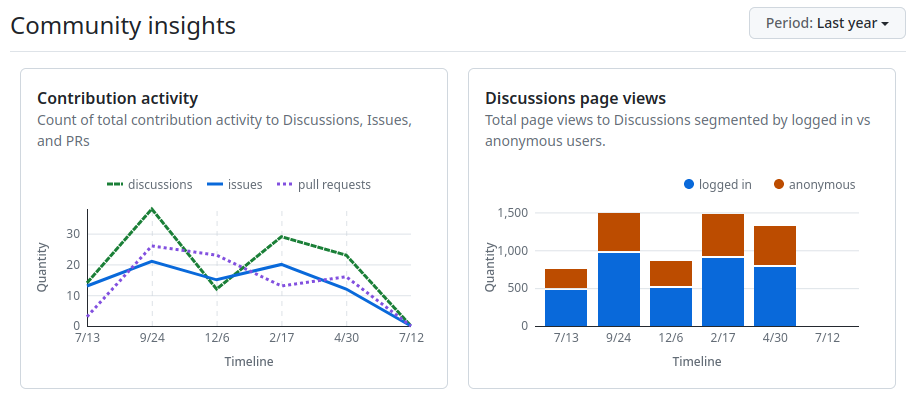

## Who We Are {data-background-image="media/map.png"}

<!-- # A bit of history: Crazyswarm1 -->

##
```{=html}
<iframe width="1600" height="600" src="https://www.youtube.com/embed/D0CrjoYDt9w?autoplay=1&mute=1" title="Crazyswarm: a large nano-quadcopter swarm (Sep. 2016)" frameborder="0" allow="accelerometer; autoplay; clipboard-write; encrypted-media; gyroscope; picture-in-picture; web-share" referrerpolicy="strict-origin-when-cross-origin" allowfullscreen></iframe>
```

## History of Crazyswarm1

- Initial release 2016
- Flights with up to 49 Crazyflies
- Technical Insights
    - More autonomy on-board robots (EKF, nonlinear controller, basic planning)
    - Heavily rely on motion capture (custom frame-by-frame tracking) & radio broadcasts
- Widely used in research (as of 2022)

    {width=60%}

<!-- 
## Lessons Learned

- Support (and testing) is crucial for community acceptance
    - This tends to be a lot of work
- Debugging / failure analysis becomes much more difficult as number of robots increase
- Requirements by researchers vary a lot
    - On-board vs Off-board
    - Centralized vs Distributed
    - Fidelity vs Speed of Simulation
    - Heterogeneous robots
- Field moves towards full autonomy (larger robots, smaller team size)
    - Many papers cite Crazyswarm 1 as “negative example” (heavily centralized and dependent on motion capture) -->

# Crazyswarm2

## Architecture

{width=70%}

<!-- 
## Design Focus

1. Clean ROS 2 Design
    - Independence of motion capture 
    - Better integration with ROS ecosystem

2. Simulation
    - Different fidelity/speed levels
    - Integration with other robots

3. Reliability
    - Online swarm monitoring
    - Automated tests
-->

<!-- 
## Side Note: Motion Capture Tracking

- Robots have one or more markers (configuration can be identical)
    - Custom frame-by-frame tracking (w/ dynamics filter)
    - Support for many systems (OptiTrack, VICON, Qualisys, VRPN, …)
    - Initial position must be known

    {width=20%}

- Separate [ROS 2 package](https://github.com/IMRCLab/motion_capture_tracking)
- Other supported tracking methods: LightHouse, UWB, (FlowDeck) 
-->

# Swarm Handling

## Crazyflie Server

::: {.container}
:::: {.col}
- Receives a list of Crazyflie URIs and ROS server parameters
- Connects to multiple Crazyflies though multiple Crazyradio PAs
- Sets logging and parameters, and several services
- Has multiple backends
    - Crazyflie python library by Bitcraze
    - Crazyflie c++ library by IMRClab
    - Simulation backend (will be mentioned later)
::::
:::: {.col}
{width=100%}
::::
:::


<!-- ## Swarm Monitoring

- Reasoning
- GUI explanation
- Status information sent
- Need picture -->

## Tabletop Demo

- crazyflies_tabletop.yaml: configure crazyflies, parameters, and logging
- Launch server
```
ros2 launch crazyswarm2_rss2024_demo launch_tabletop.py
```
- Plot data live
```
ros2 run plotjuggler plotjuggler
```
- Change parameters live
```
rqt
```


# Simulation

## Simulation

::: {.container}
:::: {.col-two}
- Goals
    - Test before crash
    - Data collection for ML methods (IL or RL)
- Different physics backends
    - None (visualize desired motion), numpy, neuralswarm, ...
- Different visualizations
    - Rviz, pdf, blender, ...
- Implemented as a crazyflie_server (same ROS 2 API)
    - GUI and Python scripts work without changes
- Software-in-the-loop (SITL)
::::
:::: {.col-one}
{width=80%}

::: {.box-ex}
:::: {.box-ex-title}
Great survey paper
::::
{width=50%}

<!-- “Survey of Simulators for Aerial Robots”, Dimmig et. al., IEEE RAM 2024 (to appear) {.font-weight=50} -->
:::
::::
:::


## Simulation Demo 1: Swarm Setpoints

- Show server_sim1.yaml
- Execute simulation
```
ros2 launch crazyswarm2_rss2024_demo launch_sim1.py
```
- Resulting animation
```
firefox results.html
```

## Simulation Demo 2: Downwash

- Change server.yaml config file

```
    sim:
      backend: neuralswarm        # see backend folder for a list 
```

- Execute simulation
```
ros2 launch crazyswarm2_rss2024_demo launch_sim2.py
```
- [result.html](media/result.html){target="_blank"}
- [result.pdf](media/result.pdf){target="_blank"}

# Python API

## Services and API wrapper

::: {.container}
:::: {.col-one}
- Server setup ROS2
    - Command and logging topics
    - Command  Services
    - All crazyflie parameters
- This is done for each connected crazyflie and for all, which is a lot!
- Python ROS2 wrapper to simply scripting and behavior
::::
:::: {.col-one}

::::
:::

## Demo

- Show script `swap.py`
- Execute flight
```
ros2 launch crazyswarm2_rss2024_demo launch_sim2_real.py
```

# Application Examples

## Mapping Using Existing ROS 2 Packages

::: {.container}
:::: {.col-two}
- Crazyswarm2 can also be interfaced with other external packages
- `scan` and `odom` for Nav2 or other navigation packages
- Command the crazyflies with teleop keyboard
- Relies on many other packages, including a [map merger](https://github.com/abdulkadrtr/mapMergeForMultiRobotMapping-ROS2)

```
ros2 launch crazyswarm2_rss2024_demo swarm_mapper_launch.py
```

```
ros2 run teleop_twist_keyboard teleop_twist_keyboard
```

::::
:::: {.col-one}

::::
:::


## {data-background-video="media/mapping.mkv"}


## Optional: Synchronized Data Collection With Collision Avoidance

- Show script `random_flight.py` (clock synchronization, data collection, collision avoidance)

## {data-background-video="media/dataCollection.mp4"}

# Conclusion

## Future Work

1. Connection Link Issues (Cpp backend)
2. Scalability (number of robots)
    - GUI responsiveness
    - Python backend
    - Simulation w/ physics
    - Validation for > 5 robots
3. Heterogeneous Simulation
4. Release (motion_capture_tracking is already released)

## How To Get Support?

- GitHub Discussions for almost everything

    

- GitHub Issue, if you are confident code changes are needed


## Crazyswarm2

::: {.container}
:::: {.col}
[?]{.r-fit-text}
::::
:::: {.col}
{width=300}
::::
:::